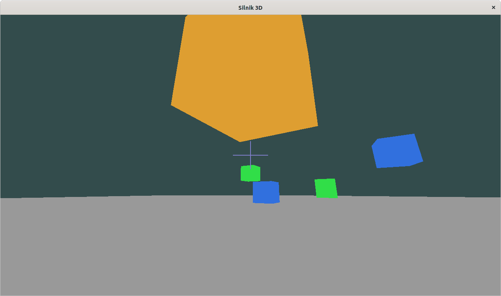

# Opis i logika gry

Cel gry to przetrwanie największej ilości fal wrogów. Gracz może poruszać sie po
płaszczyźnie i strzelać raz na sekundę. Trafienie wroga natychmiast go eliminuje, gdy
jeden z wrogów zbliży się za bardzo do gracza, gra się kończy.

{width=80%}

\newpage

## Rodzaje przeciwników

Przeciwnik ma jeden z trzech różnych rodzajów zachowania.

```cpp
enum class AiVariant {
    StraightLineMovement,
    SinusoidalMovement,
    CircularMovement
};
```

* StraightLineMovement - przeciwnik zbliża się do gracza w linii prostej.

    ```cpp
    if (m_ai_variant == AiVariant::StraightLineMovement) {
        m_position += player_vec_normal * time_diff * EnemyConstants::APPROACH_SPEED;
    }
    ```

* SinusoidalMovement - przeciwnik porusza się w stronę gracza w linii prostej, ale
  wychyla się też na boki, żeby było go trudniej trafić.

    ```cpp
    if (m_ai_variant == AiVariant::SinusoidalMovement) {
        m_position += player_vec_normal * time_diff * EnemyConstants::APPROACH_SPEED;
        auto cross = glm::normalize(glm::cross(player_vec, glm::vec3(0.0, 1.0, 0.0)));
        auto cross_multiplier = sinf(time / EnemyConstants::SINUS_FREQUENCY)
                              * EnemyConstants::SINUS_MULTIPLIER;
        m_position += cross * cross_multiplier;
    }
    ```

* CircularMovement - przeciwnik porusza się po okręgu, którego środek to pozycja
  gracza. Promień okręgu zmniejsza się z czasem.

    ```cpp
    if (m_ai_variant == AiVariant::CircularMovement) {
        m_radian_position += EnemyConstants::RADIAL_SPEED * time_diff;
        m_player_distance -= EnemyConstants::APPROACH_SPEED * time_diff;
        float x = sinf(m_radian_position) * m_player_distance;
        float y = tanf(glm::radians(45.0f)) * m_player_distance;
        float z = cosf(m_radian_position) * m_player_distance;
        m_position = player_position + glm::vec3(x, y, z);
    }
    ```

## Kolory przeciwników

* StraightLineMovement - niebieski
* SinusoidalMovement - zielony
* CircularMovement - pomarańczowy

```cpp
const std::unordered_map<Enemy::AiVariant, glm::vec4> Enemy::AI_COLOR_MAP {
    {AiVariant::StraightLineMovement, glm::vec4(0.192, 0.439, 0.871, 1.0)},
    {AiVariant::SinusoidalMovement,   glm::vec4(0.192, 0.871, 0.282, 1.0)},
    {AiVariant::CircularMovement,     glm::vec4(0.871, 0.620, 0.192, 1.0)},
};
```

## Pojawianie się nowych przeciwników

Fala wrogów pojawia się raz na pięć sekund. Po każdych pięciu falach, kolejne fale
będą miały jednego więcej przeciwnika. Wynik gracza to ilość przetrwanych fal. Wynik
pokazuje się w terminalu po śmierci gracza.

```cpp
int World::update(float absolute_time, float time_diff, glm::vec3 player_pos) {
    auto not_spawned_time = absolute_time - m_last_spawn_time;
    if (not_spawned_time > 5.0) {
        for (int i = 0; i < 1 + ((int) m_spawn_count / 5); i++) {
            auto degrees = rand() % 360;
            auto radius = 5 + rand() % 5;
            m_enemies.push_back(Enemy(degrees, radius, player_pos));
            m_last_spawn_time = absolute_time;
        }

        m_spawn_count++;
    }

    for (auto& enemy: m_enemies) {
        enemy.update(time_diff, player_pos);
        if (enemy.player_disance(player_pos) <= EnemyConstants::ENEMY_RADIUS)
            return m_spawn_count; // Zwrócenie wyniku oznacza koniec gry
    }

    return -1;
}
```

## Wykrywanie trafienia przeciwnika

Trafienie przeciwnika wykrywa się przez obliczenie odległości pomiędzy przeciwnikiem
i prostą reprezentującą trajektorię strzału. Jeśli wartość jest mniejsza, niż
ustalona - przeciwnik umiera.

```cpp
class Ray {
    glm::vec3 m_origin;
    glm::vec3 m_direction;

    public:
    Ray(glm::vec3 origin, glm::vec3 direction)
        : m_origin(origin),
          m_direction(glm::normalize(direction)) {}

    glm::vec3& origin()    { return m_origin; }
    glm::vec3& direction() { return m_direction; }

    glm::vec3 closest_point_on_ray(glm::vec3 point) {
        glm::vec3 v = point - m_origin;
        float d = glm::dot(v, m_direction);
        return m_origin + m_direction * d;
    }
};
```

---

```cpp
void World::handle_ray(Ray ray) {
    int killed_enemy = -1;
    float killed_enemy_distance = 99999;

    for (int i = 0; i < (int) m_enemies.size(); i++) {
        auto& enemy = m_enemies[i];
        auto closest_point = ray.closest_point_on_ray(enemy.pos());
        auto distance = glm::length(closest_point - enemy.pos());
        if (distance < 1.0f) {
            auto origin_distance = glm::length(ray.origin() - enemy.pos());
            if (origin_distance < killed_enemy_distance) {
                killed_enemy_distance = origin_distance;
                killed_enemy = i;
            }
        }
    }

    if (killed_enemy != -1)
        m_enemies.erase(m_enemies.begin() + killed_enemy);
}
```

# Klasy obsługujące OpenGL

## Renderer

Klasa ta zajmuje się rysowaniem elementów świata i interfejsu użytkownika:
przeciwników, podłogi, celownika. Przechowuje opisane poniżej klasy Shader i Mesh dla
każdego z tych elementów.

```cpp
class Renderer {
    Shader m_enemy_shader;
    Mesh m_enemy_mesh;

    Shader m_floor_shader;
    Mesh m_floor_mesh;

    Shader m_crosshair_shader;
    Mesh m_crosshair_mesh;

    Camera& m_camera;

    public:
    Renderer(Shader enemy_shader,
             Mesh enemy_mesh,
             Shader floor_shader,
             Mesh floor_mesh,
             Shader crosshair_shader,
             Mesh crosshair_mesh,
             Camera& camera)
        : m_enemy_shader(enemy_shader),
          m_enemy_mesh(enemy_mesh),
          m_floor_shader(floor_shader),
          m_floor_mesh(floor_mesh),
          m_crosshair_shader(crosshair_shader),
          m_crosshair_mesh(crosshair_mesh),
          m_camera(camera) {

          auto projection = glm::perspective(
              glm::radians(90.0f),
              (float)WIDTH / (float)HEIGHT,
              0.1f, 100.0f
          );

          m_enemy_shader.use();
          m_enemy_shader.setMat4("projection", projection);
          m_floor_shader.use();
          m_floor_shader.setMat4("projection", projection);
          m_crosshair_shader.use();
          m_crosshair_shader.setVec4("color", glm::vec4(0.5, 0.5, 0.8, 1.0));
    }

    void draw_enemy(Enemy& enemy);
    void draw_floor();
    void draw_crosshair(bool can_shoot);
};
```

```cpp
void Renderer::draw_enemy(Enemy& enemy) {
    m_enemy_shader.use();

    // view
    auto view = m_camera.GetViewMatrix();
    m_enemy_shader.setMat4("view", view);

    // model
    auto model = glm::mat4(1.0f);
    model = glm::translate(model, enemy.pos());
    m_enemy_shader.setMat4("model", model);

    // color
    m_enemy_shader.setVec4("color", enemy.color());

    m_enemy_mesh.use();
    m_enemy_mesh.draw();
}

void Renderer::draw_floor() {
    m_floor_shader.use();
    
    auto floor_pos = m_camera.pos();
    floor_pos.y -= 2.0f;

    auto model = glm::mat4(1.0f);
    model = glm::translate(model, floor_pos);
    m_floor_shader.setMat4("model", model);

    m_floor_shader.setMat4("view", m_camera.GetViewMatrix());
    m_floor_mesh.use();
    m_floor_mesh.draw();
}

void Renderer::draw_crosshair(bool can_shoot) {

    auto color = glm::vec4(0.5, 0.5, 0.8, 1.0);

    if (!can_shoot) {
        color.b = 0.5;
        color.r = 1.0f;
    }

    m_crosshair_shader.use();
    m_crosshair_shader.setVec4("color", color);
    m_crosshair_mesh.use();
    m_crosshair_mesh.draw();
}
```

## Mesh

Klasa ta zajmuje się przechowywaniem informacji o modelu obiektu OpenGL.

```cpp
class Mesh {
    unsigned m_VBO;
    unsigned m_VAO;
    size_t m_float_count;
    
    public:
    Mesh(const float* vertices, size_t float_count) {
        m_float_count = float_count;

        glGenVertexArrays(1, &m_VAO);
        glGenBuffers(1, &m_VBO);

        glBindVertexArray(m_VAO);
        glBindBuffer(GL_ARRAY_BUFFER, m_VBO);

        glBufferData(
            GL_ARRAY_BUFFER,
            float_count * sizeof(float),
            &vertices[0],
            GL_STATIC_DRAW
        );

        glVertexAttribPointer(0, 3, GL_FLOAT, GL_FALSE, 3*sizeof(float), 0);
        glEnableVertexAttribArray(0);
    }

    void use() {
        glBindVertexArray(m_VAO);
    }

    void draw() {
        glDrawArrays(GL_TRIANGLES, 0, m_float_count);
    }
};
```

## Shader

Klasa jest długa i służy do ładowania z pliku na dysku shadera, kompilowania go i
sprawdzania błędów. Ma też metody pozwalające łatwo ustawiać zmienne uniform.
